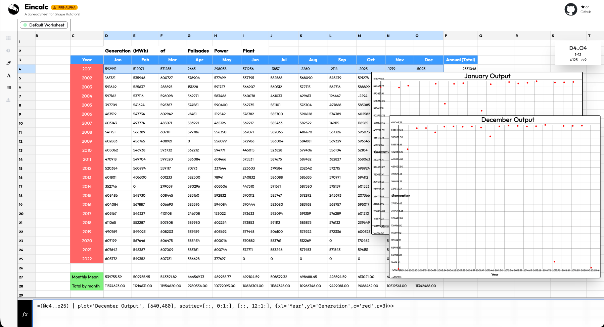

## Eincalc Sheet (pre-alpha)



Eincalc is spreadsheet engine modeled around basic tensor operations targeting
mainly the web. Unlike most spreadsheet engines the formulae are separated from 
the grid for easier management. At the moment it supports. 

- [x] Calculations
    - [x] Arithmetic operations
    - [x] Einsum evaluation
- [x] Formulaes
    - [x] Rescaling 
        - [x] MinMax
        - [x] Zscore
    - [x] Tendencies
        - [x] Mean
        - [x] Stddev
        - [x] Sum
        - [x] Cumulative Summing
    - [x] Reshaping
    - [x] Slicing
    - [x] Axis based operations (e.g Mean along an axis)
    - [x] Reading and Writing values to cells
- [ ] 🚧 Draw and Plotting
- [ ] 🚧 Generator functions (not yet lazy)
    - [x] Random number 
    - [x] Diagonal matrices
    - [x] Ones, Zeros, Fill or Alternating values
- [ ] 🚧 Serialization 
- [ ] 🚧 Cell Reactivity
- [ ] 🚧 Custom data types
    - [x] Float values | arrays
    - [ ] Complex numbers 
    - [ ] Custom data types
    - [ ] 🚧 Text embedding
    - [ ] 🚧 Streams
        - [ ] Images 
        - [ ] Video 
        - [ ] Audio
- [ ] 🚧 [WebNN](https://www.w3.org/TR/webnn/)
- [ ] 🚧  OCR and gen-AI ??

### Building the project

The main project is in Ocaml which can be interfaced via a repl on the command
line and a web interface.

#### Requirements

 * Ocaml version 5.0+
 * Dune (Ocaml build system) and Js of Ocaml installed via opam
 * Bun js (for the Svelte frontend)

To build and run the repl:

```bash 
dune build --profile release
dune exec  --profile release eincalc
```

To use the frontend

```bash 
dune build --profile release && cd ./bin/web && bun i && bun dev
```

### Formulae

##### Operators 

These functions can be executed in the repl or the formula input of the web
version. Only number and text values can be written into the cell

Add 2 numbers 

```
> =2+2 
```

Compute result and write to cell A1. (Parantheses aid in clarity of the
expression)

```
> =((6 / 3) + 3) | write<A1>
```

Multiply 2 Arrays and write result to B2. (Note that tensor result will be
interpreted in Row major form whilst being written to the grid). Eincalc will
check whether the operations can be broadcasted together

```
> =([ 1,2,3 ] * [ 4, 5, 6 ]) | write<B2>
```

Add 5 to each element fetched from the grid and write back to the grid

```
> =((@B2..D2) + 5)
```

Or write it back in reverse (the start and end cells in the range are swapped
for this effect) 

```
> =((@D2..B2) + 5)
```

You can use einsum to transpose a matrix, multiply all elements by 3 and write it to the grid 

```
> = ((ij -> ji, [[[1,2,3]],[[4,5,6]]]) | write<B6>
```

`PS: You cannot evaluate expressions within an einsum expression at the moment`

Generate random matrices  and multiply them using einsum then write them back

```
> =(ij, jk -> ik, @rand<100,[6,6]>, @rand<100,[6,6]>) | write<A1>
```


Same as above but with z-score normalization. The masks can be used within
einsum expression but math expressions don't work.

```
=(ij, jk -> ik, @rand<100,[6,6]> | zscore, @rand<100,[6,6]> | zscore) | write<A1>
```
```


